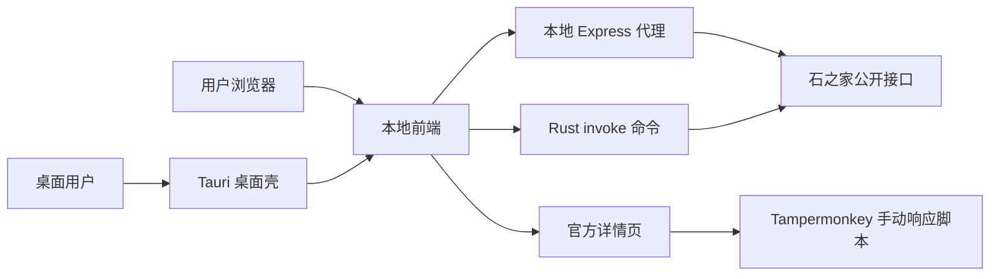

# 架构说明

## 总览

本项目由三部分组成：

- 前端：React + Vite + TypeScript，负责条件选择、本地筛选和结果展示。
- 本地代理：Express，负责访问石之家公开接口并规整返回数据。
- 桌面壳：Tauri 原型，负责在桌面应用内通过 Rust 命令直接访问公开接口。
- 官方页脚本：Tampermonkey，只在官方域名下提供手动响应辅助。

## 数据流



## 本地代理职责

- 聚合元数据：副本、标签、职业、大区。
- 对招募列表按官方参数分页拉取。
- 强制要求 `fb_name` 非空，避免无边界拉全站招募。
- 保留请求间隔、最大页数、取消和重试。
- 代理单条招募详情，用于按需展开卡片。
- 在 production/portable 模式下提供前端静态文件。

## Tauri 桌面职责

- 复用同一套 React 前端。
- 在桌面运行时把 API 调用切换为 `@tauri-apps/api/core.invoke`。
- Rust 命令层直接访问石之家公开接口，不启动本地 Node/Express 服务。
- 为后续 Tauri updater、安装包签名和更低误报分发形态打基础。

## 前端职责

- 管理官方拉取条件。
- 管理本地二次筛选条件。
- 保存本地 UI 状态。
- 展示分页拉取状态、警告和结果卡片。
- 打开官方详情页。

## 明确不做

- 不保存账号、Cookie、Token。
- 不读取官方站点 HttpOnly Cookie。
- 不直接代替账号响应招募。
- 不自动批量请求所有招募详情。
- 不做无界分页或全站抓取。

## 发布形态

开发期：

```text
Vite dev server -> /api proxy -> Express
```

便携包发布期：

```text
Browser -> Express static + /api -> Official API
```

Windows 便携包会把 Express 后端打包为 `server.cjs`，并携带 Node.js 运行时。

桌面 App 原型：

```text
Tauri WebView -> React -> Rust invoke -> Official API
```

当前桌面 App 原型已落地源码和前端运行时切换；原生安装包构建需要本机安装 Rust/Cargo 后执行 `npm run desktop:build`。
