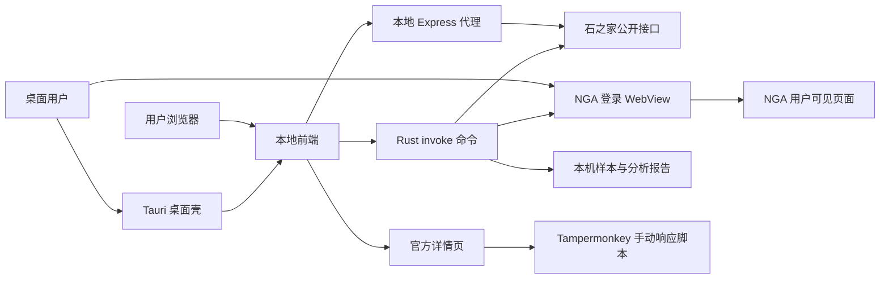

# 架构说明

## 总览

本项目由三部分组成：

- 前端：React + Vite + TypeScript，负责条件选择、本地筛选和结果展示。
- 本地代理：Express，负责访问石之家公开接口并规整返回数据。
- 桌面壳：Tauri 原型，负责在桌面应用内通过 Rust 命令直接访问公开接口。
- NGA 本地聚合：仅在 Tauri 桌面版内通过用户可见 WebView 登录和采集当前页面公开招募内容。
- 官方页脚本：Tampermonkey，只在官方域名下提供手动响应辅助。

## 数据流



## 本地代理职责

- 聚合元数据：副本、标签、职业、大区。
- 对招募列表按官方参数分页拉取。
- 强制要求 `fb_name` 非空，避免无边界拉全站招募。
- 保留请求间隔、最大页数、取消和重试。
- 代理单条招募详情，用于按需展开卡片。
- 在 Node 便携包中执行用户确认式一键更新：校验 Release zip、下载、退出、覆盖并重启。
- 在 production/portable 模式下提供前端静态文件。

## Tauri 桌面职责

- 复用同一套 React 前端。
- 在桌面运行时把 API 调用切换为 `@tauri-apps/api/core.invoke`。
- Rust 命令层直接访问石之家公开接口，不启动本地 Node/Express 服务。
- Rust 命令层执行桌面便携包用户确认式一键更新。
- Rust 命令层提供 NGA 登录 WebView、保持登录状态 WebView profile、清除本机 NGA profile、受支持招募页状态检查、可见页面样本采集、逐帖详情正文采集、已存样本正文补齐、本地样本 JSON 保存、采集进度查询和取消采集。
- NGA 采集只读取当前 WebView 已渲染页面中的帖子标题、正文、链接、作者、发布时间、版面 ID 和主题 ID，不读取 Cookie、token、localStorage、sessionStorage 或其他站点认证数据。
- 为后续正式 updater、安装包签名和更低误报分发形态打基础。

## 前端职责

- 管理官方拉取条件。
- 管理本地二次筛选条件。
- 保存本地 UI 状态。
- 展示分页拉取状态、警告和结果卡片。
- 统一展示官方与 NGA 来源卡片，并打开对应详情页。
- 展示 NGA 登录状态、保持登录状态风险提示、清除登录状态、招募板块快捷入口、采集范围、请求间隔、最大数量、详情正文采集选项、进度、停止按钮、最近采集时间和本地保存位置说明。
- 基于 NGA 样本生成分析报告和待用户确认问题清单；已确认术语进入 Parser v1，输出结构化字段、置信度、证据片段、warning 和 tag。

## 明确不做

- 不保存账号、Cookie、Token。
- 不读取官方站点 HttpOnly Cookie。
- 不读取、解析、导出或上传 NGA WebView 的 Cookie、token、localStorage、sessionStorage 或其他站点认证数据。
- 不实现 NGA 自动登录，不绕过验证码、风控、访问权限、站点限制或反自动化机制。
- 不做后台不可见采集；NGA 采集必须由用户触发，在 UI 中可见、可取消、有限频；当前页采集入口只接受已确认的国服/日服招募板和帖子详情页。
- 不直接代替账号响应招募。
- 不自动批量请求所有招募详情。
- 不做无界分页或全站抓取。

## 发布形态

开发期：

```text
Vite dev server -> /api proxy -> Express
```

便携包发布期：

```text
Browser -> Express static + /api -> Official API
```

Windows 便携包会把 Express 后端打包为 `server.cjs`，并携带 Node.js 运行时。

桌面 App 原型：

```text
Tauri WebView -> React -> Rust invoke -> Official API
Tauri WebView -> React -> Rust invoke -> NGA login WebView -> visible page samples -> local analysis report -> Parser v1 fields/tags/warnings
```

当前桌面 App 原型已落地源码和前端运行时切换；原生安装包构建需要本机安装 Rust/Cargo 后执行 `npm run desktop:build`。
