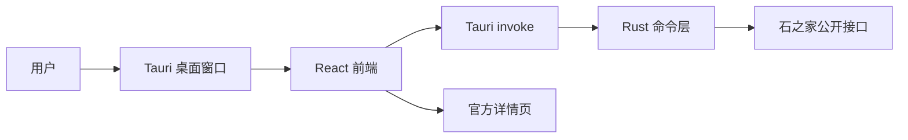

# Tauri 桌面客户端原型说明

## 目标

Tauri 桌面客户端用于替代“zip + node.exe + bat”的主分发形态，让普通用户获得更接近常规 Windows 应用的体验。

当前阶段是原型：

- 复用现有 React + Vite 前端。
- 在 Tauri 运行时通过 `@tauri-apps/api/core.invoke` 调用 Rust 命令。
- Rust 命令直接请求石之家公开接口，不启动本地 Express 服务。
- 现有 Express 和 Windows 便携包仍保留，作为开发和备用分发路径。

## 架构



## 当前命令

安装依赖：

```powershell
npm ci
```

开发运行：

```powershell
npm run desktop:dev
```

构建 Windows 安装包：

```powershell
npm run desktop:build
```

## 本机前置条件

Tauri 原生构建需要 Rust/Cargo 和 Windows 桌面构建环境。当前开发机在本轮检查时没有安装 `cargo`，所以 `npm run desktop:build` 会停在：

```text
failed to run 'cargo metadata' ... program not found
```

安装 Rust 后需要重新执行：

```powershell
cargo --version
npm run desktop:build
```

## Rust 命令层

当前原型提供这些命令：

- `risingstones_version`
- `risingstones_meta`
- `risingstones_recruits`
- `risingstones_recruit_detail`
- `risingstones_geoip`
- `risingstones_check_update`

这些命令对齐现有 Express `/api/*` 的响应结构，前端会自动判断运行环境：

- 普通浏览器：继续请求 `/api/*`。
- Tauri 桌面：改用 `invoke(...)`。

## 安全边界

- 不保存账号、Cookie、Token 或官方登录态。
- 不直接代替账号响应招募。
- 招募响应仍跳转官方页面或使用官方页 Tampermonkey 手动脚本。
- Gitee 私有镜像地址仍通过本机环境变量或发布配置注入，不写入公开源码。

## 后续计划

- 安装 Rust 后完成 `desktop:build` 原生验证。
- 增加应用图标和 Windows 安装器元数据。
- 接入 Tauri updater，使用 GitHub/Gitee Release 分发签名更新包。
- 评估 Windows 代码签名证书，降低浏览器和系统的未知软件提示。
- 移动端另开 Capacitor/Tauri Mobile 方案，复用共享前端和筛选核心。
