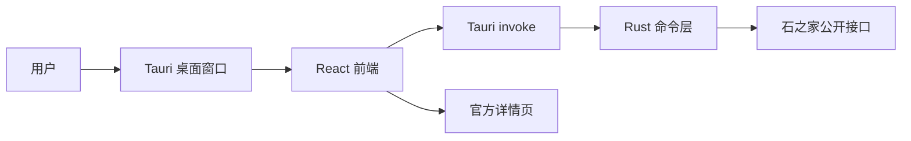

# Tauri 桌面客户端说明

## 目标

Tauri 桌面客户端用于替代“zip + node.exe + bat”的主分发形态，让普通用户获得更接近常规 Windows 应用的体验。

当前阶段已完成 Windows 桌面便携版实机构建验证：

- 复用现有 React + Vite 前端。
- 在 Tauri 运行时通过 `@tauri-apps/api/core.invoke` 调用 Rust 命令。
- Rust 命令直接请求石之家公开接口，不启动本地 Express 服务。
- 现有 Express 和 Node Windows 便携包仍保留，作为 Web 开发和备用分发路径。

## 架构



## 当前命令

安装依赖：

```powershell
npm ci
```

开发运行：

```powershell
npm run desktop:dev
```

构建 Windows 安装包：

```powershell
npm run desktop:build
```

构建 Windows 桌面便携包：

```powershell
npm run package:desktop:portable
```

`desktop:build` 和 `desktop:build:portable` 通过 `scripts/run-tauri-build.mjs` 启动。该 wrapper 会在 Windows 上自动把 `~/.cargo/bin` 加入 PATH，并通过 `vswhere` 查找 Visual Studio C++ 环境，避免普通 PowerShell 中出现 `cargo metadata ... program not found`。

桌面便携包使用 `--no-bundle` 路径时，wrapper 会在同一个临时 `.cmd` 中加载 `VsDevCmd.bat`、构建前端并直接执行 `cargo build --release`。它还会主动扫描本机 Windows Kits 目录，写入临时链接器 wrapper 和构建环境脚本，补齐 `LIB`、`LIBPATH`、`INCLUDE`，避免 `windows.h`、`OleAut32.lib`、`advapi32.lib` 等 Windows SDK 路径偶发丢失。

## 本机前置条件

Tauri 原生构建需要 Rust/Cargo 和 Windows 桌面构建环境。本机已验证：

```text
rustc 1.95.0
cargo 1.95.0
stable-x86_64-pc-windows-msvc
Visual Studio 2026 C++ x64 toolchain
```

如果当前 PowerShell 没有 VS C++ 编译环境，可用 VS Developer Command Prompt，或显式加载 `VsDevCmd.bat` 后再构建。

rustup 安装时若提示已有：

```text
C:\Users\<User>\.rustup\settings.toml
```

这不是构建失败；只要显式安装并设定 `stable-x86_64-pc-windows-msvc` 即可。

## 已验证产物

当前已通过 `npm run package:desktop:portable` 生成：

```text
release/risingstones-partyfinder-helper-v0.1.5-desktop-win-x64-portable.zip
release/risingstones-partyfinder-helper-v0.1.5-desktop-win-x64-portable.zip.sha256
```

SHA256：

```text
以同目录 `.zip.sha256` 文件为准。
```

zip 内主程序：

```text
RisingStones-PartyFinder-Desktop.exe
```

短启动验收：主程序可启动并显示窗口标题 `FF14 副本招募筛选器`。

GitHub Release workflow 已接入该构建命令，打 `v*` 标签时会同时生成 Node 便携包和 Tauri 桌面便携包。

桌面便携包会在 zip 根目录写入 `release-manifest.json`。如果发布机设置了 `RISINGSTONES_UPDATE_GITEE_REPO` 或本机 `config/release.local.json`，manifest 会包含国内镜像更新源；Tauri 运行时从 EXE 同目录读取该 manifest，再用于 GeoIP 推荐和更新检查。

## 安装包状态

`npm run desktop:build` 会继续尝试生成 NSIS 安装包。本机实测 Rust release 编译已经通过，但 Tauri 在下载 NSIS 工具包时可能出现：

```text
failed to bundle project `timeout: global`
```

这属于安装包工具下载阶段，不影响 `--no-bundle` 生成桌面 EXE，也不影响桌面便携包发布。

## Rust 命令层

当前原型提供这些命令：

- `risingstones_version`
- `risingstones_meta`
- `risingstones_recruits`
- `risingstones_recruit_detail`
- `risingstones_geoip`
- `risingstones_check_update`
- `risingstones_install_update`

这些命令对齐现有 Express `/api/*` 的响应结构，前端会自动判断运行环境：

- 普通浏览器：继续请求 `/api/*`。
- Tauri 桌面：改用 `invoke(...)`。

`risingstones_install_update` 只允许安装本项目 Release 中的桌面便携版 zip。命令会要求 EXE 同目录存在 `release-manifest.json`，然后下载 zip、生成临时 PowerShell 覆盖脚本、退出当前程序并重启新版。开发目录或没有 manifest 的目录不会执行覆盖更新。

## 安全边界

- 不保存账号、Cookie、Token 或官方登录态。
- 不直接代替账号响应招募。
- 招募响应仍跳转官方页面或使用官方页 Tampermonkey 手动脚本。
- Gitee 私有镜像地址仍通过本机环境变量或发布配置注入，不写入公开源码。

## 后续计划

- 继续完善 Windows 安装器元数据和 NSIS 缓存方案。
- 在现有用户确认式覆盖更新基础上，继续评估正式 Tauri updater 和签名更新包。
- 评估 Windows 代码签名证书，降低浏览器和系统的未知软件提示。
- 移动端另开 Capacitor/Tauri Mobile 方案，复用共享前端和筛选核心。
